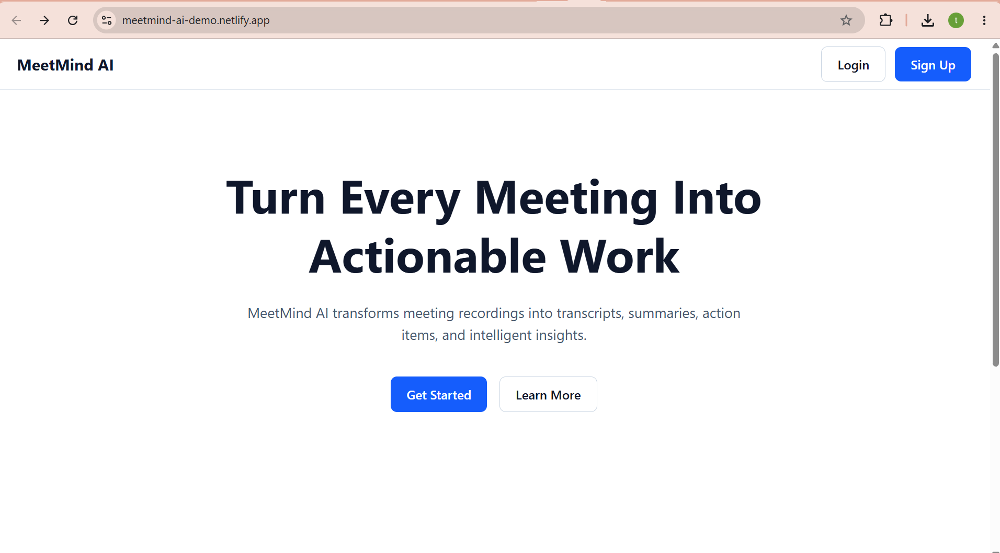
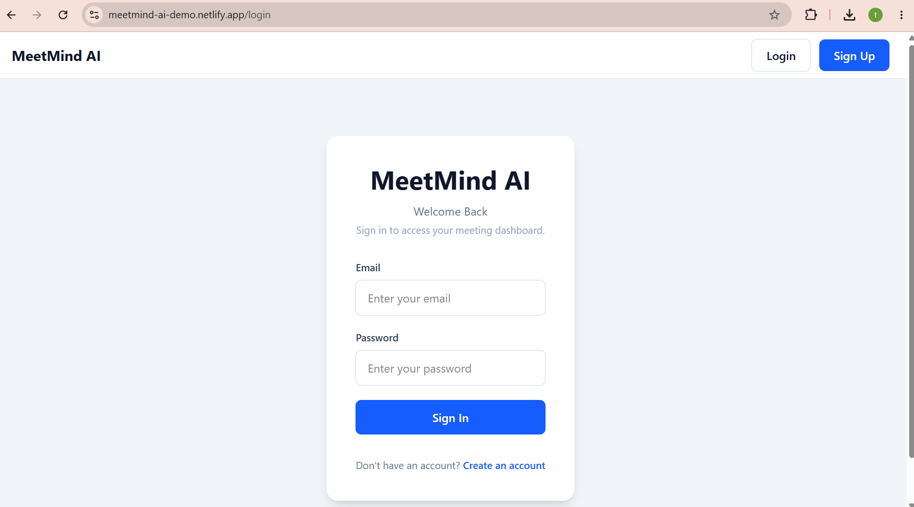
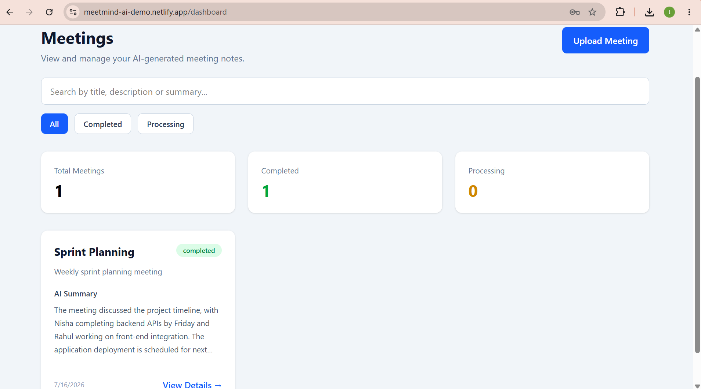
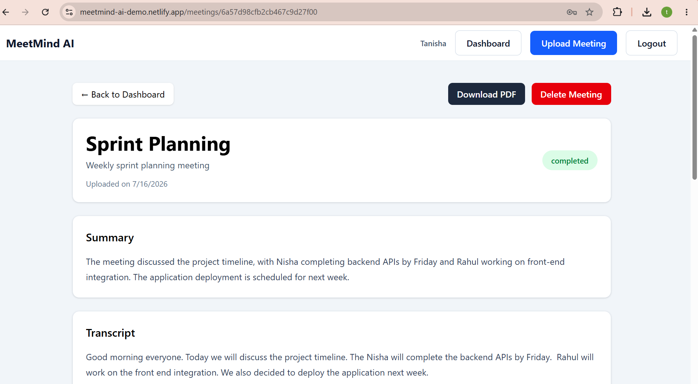
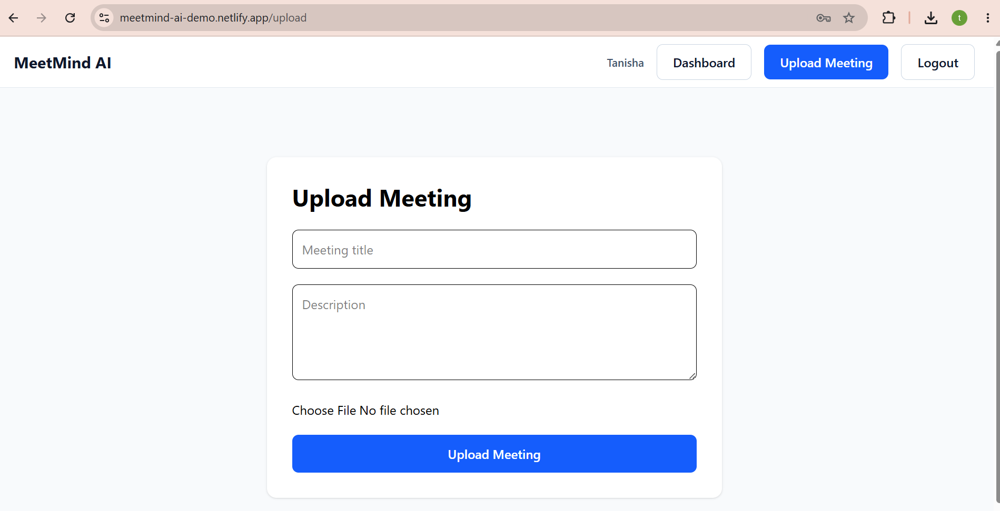
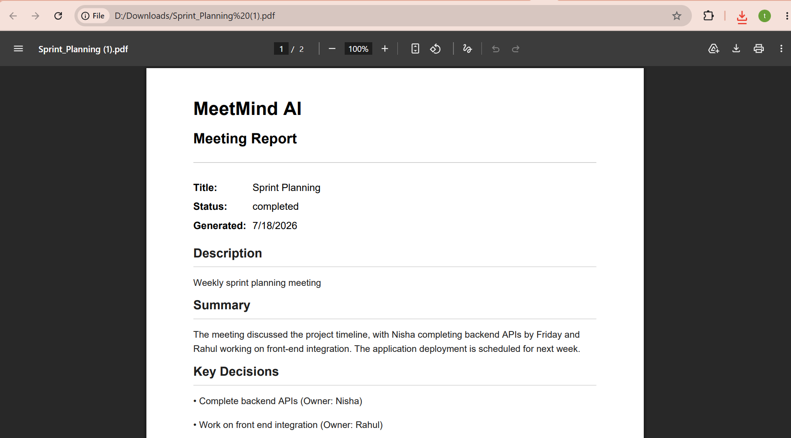

# 🧠 MeetMind AI

An AI-powered meeting assistant that transforms meeting recordings into structured meeting notes, summaries, key decisions, and actionable tasks.

Built with a modern MERN architecture and deployed using Netlify, Railway, and MongoDB Atlas.

---

## 🚀 Live Demo

🔗 Live Application: https://meetmind-ai-demo.netlify.app/

💻 GitHub Repository: https://github.com/tanisha0016/MeetMind-AI

---

## ✨ Features

- 🔐 Secure JWT Authentication
- 🎙️ Upload Meeting Audio
- 🤖 AI-generated Meeting Summaries
- ✅ Automatic Action Item Extraction
- 📌 Key Decision Extraction
- 📄 Download Meeting Notes as PDF
- 🔍 Search Meetings
- 🗂 Filter Meetings by Status
- 📱 Responsive Dashboard
- ⚡ Loading Skeletons for Better UX

---

## 🛠 Tech Stack

### Frontend

- React
- TypeScript
- Tailwind CSS
- React Router
- Axios

### Backend

- Node.js
- Express.js
- MongoDB
- Mongoose
- JWT Authentication
- Multer

### AI

- OpenAI API

### Deployment

- Netlify (Frontend)
- Railway (Backend)
- MongoDB Atlas (Database)

---

## 📷 Screenshots

### Landing Page




### Login Page




### Dashboard




### Meeting Details




### Upload Meeting 




### PDF Export



---
## 🏗 Architecture

```
                React + TypeScript
                        │
                     Axios API
                        │
                Express REST API
                        │
      JWT Authentication Middleware
                        │
                  MongoDB Atlas
                        │
                  OpenAI API
```

---

## 📂 Project Structure

```
MeetMind-AI
│
├── client
│   ├── components
│   ├── pages
│   ├── services
│   ├── routes
│   └── ...
│
├── server
│   ├── config
│   ├── middleware
│   ├── modules
│   ├── routes
│   └── ...
│
└── README.md
```

---

## ⚙️ Installation

Clone the repository

```bash
git clone https://github.com/tanisha0016/MeetMind-AI.git
```

Install frontend

```bash
cd client
npm install
```

Install backend

```bash
cd ../server
npm install
```

---

## 🔑 Environment Variables

### Client

Create a `.env`

```
VITE_API_URL=http://localhost:5000/api
```

### Server

Create a `.env`

```
PORT=5000

MONGODB_URI=

JWT_SECRET=

OPENAI_API_KEY=
```

---

## ▶️ Running Locally

### Backend

```bash
cd server
npm run dev
```

### Frontend

```bash
cd client
npm run dev
```

---

## 📄 API Endpoints

### Authentication

```
POST /api/auth/register

POST /api/auth/login
```

### Meetings

```
POST /api/meetings/upload

GET /api/meetings

GET /api/meetings/:id

PATCH /api/meetings/:id

DELETE /api/meetings/:id
```

---

## 🎯 Future Improvements

- AI Chat with Meeting Transcript
- Speaker Identification
- Calendar Integration
- Email Meeting Summaries
- Team Collaboration
- Meeting Analytics
- Dark Mode

---

## 👩‍💻 Author

**Tanisha Ahuja**

GitHub: https://github.com/tanisha0016

LinkedIn: https://www.linkedin.com/in/tanisha-ahuja/